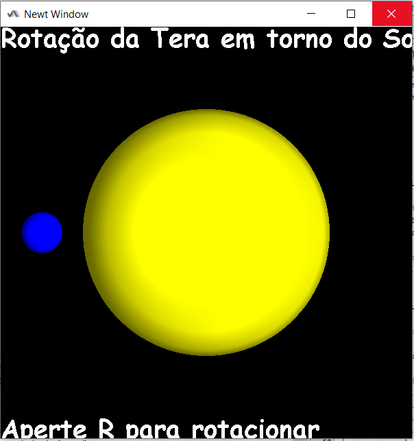
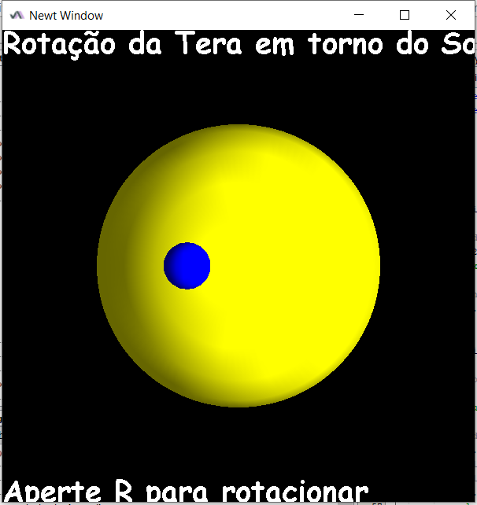

# Sistema Solar usando JOGL

Este repositório foi feito para a realização de um projeto para a faculdade no ano de 2020. Onde foi pedido a implementação de um sistema solar usando a biblioteca do Java JOGL.

O sistema solar foi implementado de forma interativa onde o usuário precisa clicar na tecla R para rotacionar a Terra ao redor do Sol.

## Executar o código

Para executar o código, basta rodar o arquivo Inicial.java dentro da pasta "cena"
